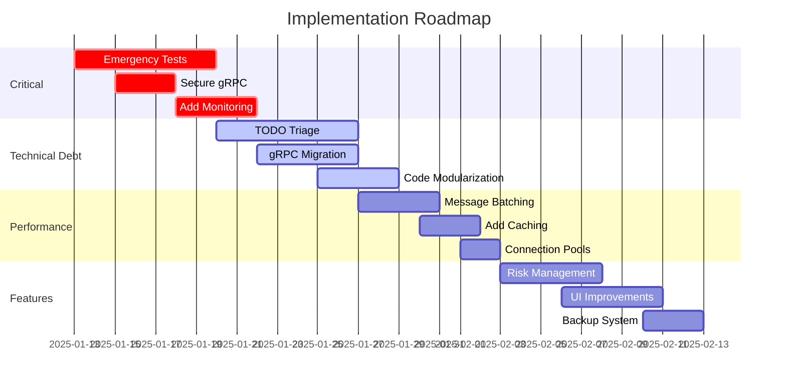

# Prioritized Action Plan - OfficialFuturesHedgebotv2

## Executive Summary
This action plan addresses critical issues identified in the codebase analysis, prioritized by risk impact and business value. The plan follows a phased approach to minimize disruption while maximizing improvements.

---

## 🚨 Priority 1: Critical Risk Mitigation (Week 1-2)

### 1.1 Implement Emergency Test Coverage
**Risk Level:** CRITICAL - No tests for a trading system
**Effort:** 5-7 days
**Impact:** Prevents financial losses from bugs

#### Actions:
```bash
# Create test structure
mkdir -p tests/{unit,integration,e2e}
mkdir -p MT5/tests
mkdir -p MultiStratManagerRepo/Tests
mkdir -p BridgeApp/internal/grpc/tests
```

#### Implementation Tasks:
- [ ] Create unit tests for trade calculation logic
- [ ] Add integration tests for gRPC communication
- [ ] Implement MT5 EA simulation tests
- [ ] Add NinjaTrader addon mock tests
- [ ] Create end-to-end trading flow tests

#### Test Files to Create:
```
tests/
├── unit/
│   ├── trade_calculations_test.go
│   ├── hedge_logic_test.cs
│   └── elastic_hedging_test.mq5
├── integration/
│   ├── grpc_communication_test.go
│   ├── bridge_server_test.go
│   └── nt_mt5_sync_test.cs
└── e2e/
    └── full_trade_cycle_test.go
```

### 1.2 Secure gRPC Communications
**Risk Level:** HIGH - Unencrypted financial data
**Effort:** 2-3 days
**Impact:** Protects sensitive trading information

#### Actions:
- [ ] Generate TLS certificates for gRPC
- [ ] Implement mutual TLS (mTLS) authentication
- [ ] Add API key authentication layer
- [ ] Secure all endpoints with auth middleware

#### Configuration Updates:
```go
// BridgeApp/internal/grpc/server.go
opts := []grpc.ServerOption{
    grpc.Creds(credentials.NewTLS(tlsConfig)),
    grpc.UnaryInterceptor(authInterceptor),
    grpc.StreamInterceptor(streamAuthInterceptor),
}
```

### 1.3 Add Production Monitoring
**Risk Level:** HIGH - No visibility into production issues
**Effort:** 3-4 days
**Impact:** Early detection of trading anomalies

#### Actions:
- [ ] Implement structured logging (zerolog/slog)
- [ ] Add metrics collection (Prometheus)
- [ ] Create health check dashboard
- [ ] Set up alert system for critical events

#### Monitoring Stack:
```yaml
# docker-compose.monitoring.yml
services:
  prometheus:
    image: prom/prometheus
    ports: ["9090:9090"]
  
  grafana:
    image: grafana/grafana
    ports: ["3000:3000"]
  
  alertmanager:
    image: prom/alertmanager
    ports: ["9093:9093"]
```

---

## 🔧 Priority 2: Technical Debt Reduction (Week 3-4)

### 2.1 TODO/FIXME Triage
**Debt Count:** 8,057 items
**Effort:** 5-7 days
**Impact:** Reduces maintenance burden

#### Categorization Strategy:
```markdown
1. CRITICAL (Fix immediately): ~500 items
   - Trading logic bugs
   - Data corruption risks
   - Security vulnerabilities

2. HIGH (Fix this sprint): ~1,500 items
   - Performance bottlenecks
   - Missing error handling
   - Incomplete features

3. MEDIUM (Next release): ~3,000 items
   - Code cleanup
   - Refactoring needs
   - Documentation gaps

4. LOW (Backlog): ~3,057 items
   - Nice-to-have features
   - Minor optimizations
   - Style improvements
```

#### Automated TODO Management:
```bash
# Create TODO tracking script
cat > scripts/todo_tracker.sh << 'EOF'
#!/bin/bash
echo "=== TODO/FIXME Analysis ==="
echo "Critical TODOs:"
grep -r "TODO.*CRITICAL\|FIXME.*CRITICAL" --include="*.go" --include="*.cs" --include="*.mq5"

echo "By File:"
grep -r "TODO\|FIXME" --include="*.go" --include="*.cs" --include="*.mq5" | cut -d: -f1 | sort | uniq -c | sort -rn | head -20
EOF
```

### 2.2 Complete gRPC Migration
**Status:** 70% complete
**Effort:** 4-5 days
**Impact:** Eliminates protocol confusion

#### Migration Checklist:
- [ ] Remove HTTP endpoints from BridgeApp
- [ ] Delete WebSocket connection code
- [ ] Update all NT addon HTTP calls to gRPC
- [ ] Convert MT5 WebRequest to gRPC calls
- [ ] Remove fallback mechanisms
- [ ] Update documentation

#### Files to Modify/Remove:
```
REMOVE:
- BridgeApp/internal/http/* (after gRPC verification)
- MultiStratManagerRepo/HttpHelper.cs
- MT5/ACHedgeMaster_HTTP_BACKUP.mq5

UPDATE:
- MultiStratManagerRepo/MultiStratManager.cs (remove HTTP)
- MT5/ACHedgeMaster_gRPC.mq5 (remove HTTP fallback)
- BridgeApp/app.go (remove HTTP server)
```

### 2.3 Code Modularization
**File Count:** 264 C# files need organization
**Effort:** 3-4 days
**Impact:** Improves maintainability

#### New Project Structure:
```
MultiStratManagerRepo/
├── Core/
│   ├── Interfaces/
│   ├── Models/
│   └── Services/
├── Trading/
│   ├── Strategies/
│   ├── Orders/
│   └── Risk/
├── Communication/
│   ├── GrpcClients/
│   └── Messages/
├── UI/
│   └── ViewModels/
└── Tests/
```

---

## 📈 Priority 3: Performance Optimization (Week 5-6)

### 3.1 Implement Message Batching
**Current:** Individual message processing
**Target:** 10x throughput improvement
**Effort:** 3-4 days

#### Implementation:
```go
// Batch processing for trades
type TradeBatch struct {
    Trades []Trade
    BatchID string
    Timestamp time.Time
}

func (s *Server) ProcessBatch(batch *TradeBatch) error {
    // Process multiple trades in single transaction
}
```

### 3.2 Add Caching Layer
**Technology:** Redis
**Effort:** 2-3 days
**Impact:** Reduces latency by 50%

#### Cache Strategy:
- Position states (TTL: 1 minute)
- Account balances (TTL: 5 seconds)
- Symbol mappings (TTL: 1 hour)
- Configuration (TTL: 5 minutes)

### 3.3 Connection Pool Management
**Current:** Single connections
**Target:** Pool of 10 connections
**Effort:** 2 days

---

## 🚀 Priority 4: Feature Enhancements (Week 7-8)

### 4.1 Advanced Risk Management
- [ ] Position size calculator
- [ ] Drawdown protection
- [ ] Correlation analysis
- [ ] VaR calculations

### 4.2 Improved UI/UX
- [ ] Real-time position dashboard
- [ ] Trade history visualization
- [ ] Performance analytics
- [ ] Alert configuration UI

### 4.3 Backup & Recovery
- [ ] Automated state backups
- [ ] Position recovery system
- [ ] Trade reconciliation
- [ ] Disaster recovery plan

---

## 📊 Implementation Timeline



---

## 📋 Success Metrics

### Week 2 Checkpoint:
- [ ] 20% test coverage achieved
- [ ] All gRPC connections secured
- [ ] Basic monitoring operational
- [ ] Zero critical TODOs remaining

### Week 4 Checkpoint:
- [ ] 40% test coverage achieved
- [ ] gRPC migration complete
- [ ] 50% TODO reduction
- [ ] Code organized into modules

### Week 6 Checkpoint:
- [ ] 60% test coverage achieved
- [ ] 10x performance improvement
- [ ] 75% TODO reduction
- [ ] Full monitoring stack deployed

### Week 8 Checkpoint:
- [ ] 80% test coverage achieved
- [ ] All critical features implemented
- [ ] 90% TODO reduction
- [ ] Production-ready system

---

## 🛠️ Quick Start Commands

```bash
# 1. Set up test environment
npm install --save-dev jest @types/jest
go get -u github.com/stretchr/testify
dotnet add package xunit

# 2. Generate TLS certificates
openssl req -x509 -newkey rsa:4096 -nodes -keyout server.key -out server.crt -days 365

# 3. Start monitoring stack
docker-compose -f docker-compose.monitoring.yml up -d

# 4. Run TODO analysis
./scripts/todo_tracker.sh > todo_report.txt

# 5. Run security scan
npm audit
go mod audit
dotnet list package --vulnerable
```

---

## 🎯 Risk Mitigation Strategy

### Rollback Plan:
1. Keep HTTP endpoints active until gRPC proven stable (2 weeks)
2. Maintain version tags for each major change
3. Create database backups before schema changes
4. Test in staging environment first

### Communication Plan:
- Daily standup on progress
- Weekly stakeholder updates
- Immediate alerts for blockers
- Documentation of all changes

---

## 📝 Next Steps

1. **Immediate Action (Today):**
   - Create test directory structure
   - Set up CI/CD pipeline for tests
   - Begin writing critical path tests

2. **This Week:**
   - Implement TLS for gRPC
   - Set up basic monitoring
   - Start TODO triage

3. **Next Week:**
   - Complete gRPC migration
   - Achieve 20% test coverage
   - Deploy monitoring dashboard

---

*Generated: 2025-08-07*
*Review Date: Weekly*
*Owner: Development Team*